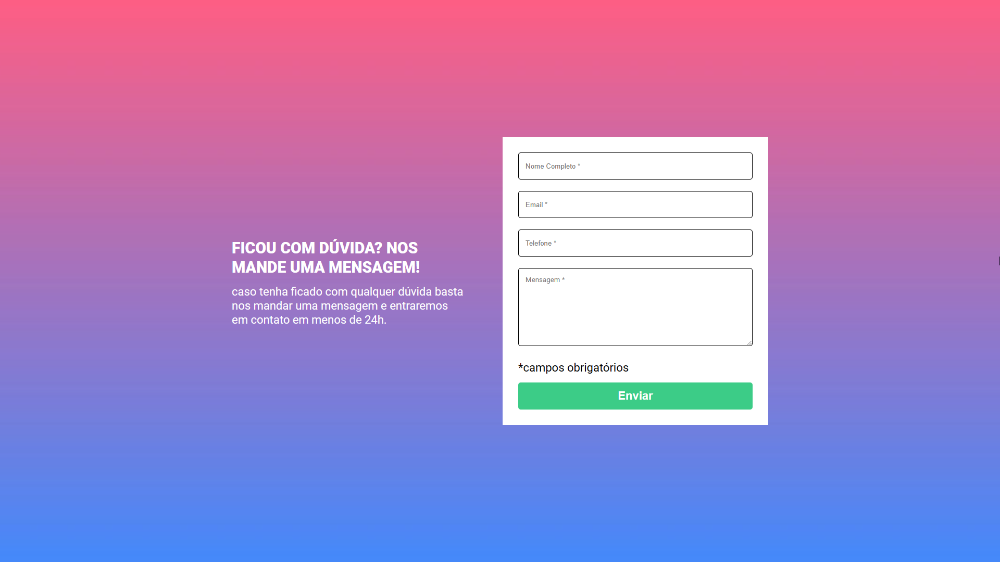
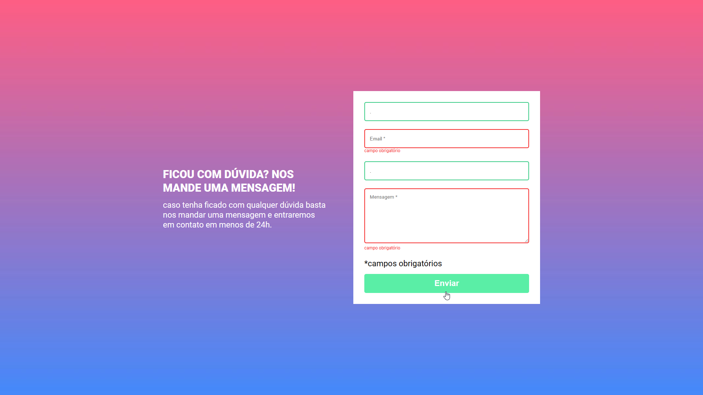
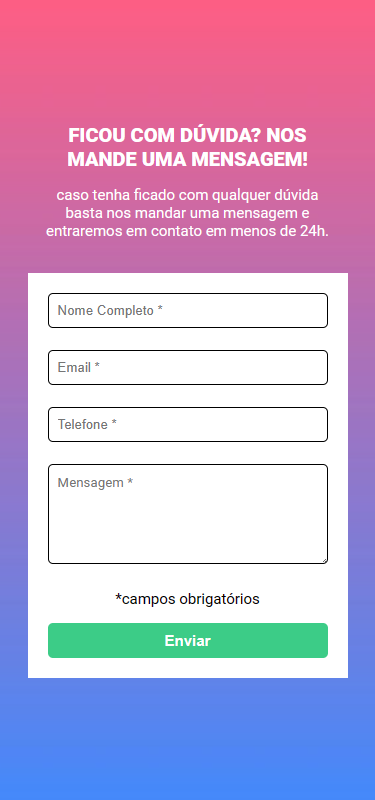

# DevQuest - EXERCÍCIOS HTML + CSS + JS INTERMEDIÁRIO

## Desafio formulário com validação

### O desafio

O usuario deve conseguir:

- Visualize o layout ideal para o site, dependendo do tamanho da tela do dispositivo
-Receba uma mensagem de erro quando o `formulário` for enviado se:
  - Qualquer campo `input` está vazio. A mensagem para este erro deve dizer *"Campo obrigatorio"*.
  - Quando o campo `input` está preenchido. A borda do input deve ficar verde.

#### Desktop Screenshot 🖥️

#### Active State 🖥️

#### Mobile Screenshot 📱

### link 🔗

- Live Site URL: https://lkiryu.github.io/desafio-formulario-com-validacao/

### Built with 🛠️

- HTML5
- CSS
- JS
---
### Author 👨‍💻
 Made by Matheus Antonio